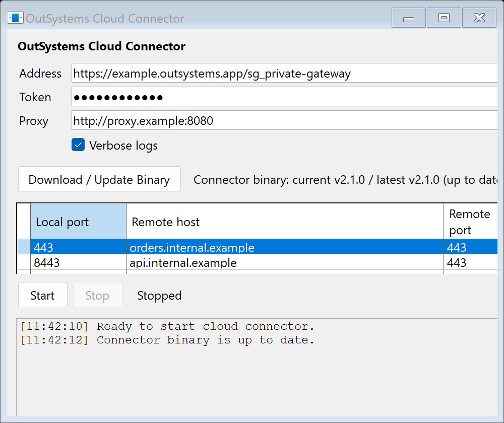

# cloud-connector-gui

A small Windows-only graphical launcher for `outsystemscc.exe`.



The app helps users build and run this command without typing the raw CLI syntax:

```text
outsystemscc.exe --header "token: <token>" [--proxy <proxy>] [-v] <address> R:<local-port>:<remote-host>:<remote-port>...
```

## Features

- Address and token inputs for the Private Gateway values from ODC Portal.
- TCP endpoint grid with local secure-gateway port, remote host, and remote port.
- Optional proxy and verbose logging.
- Start/Stop controls with live stdout/stderr log capture.
- Downloads the Windows `outsystemscc.exe` binary from stable GitHub releases of
  [`tony4outsystems/cloud-connector`](https://github.com/tony4outsystems/cloud-connector).
- Shows the installed connector version and the latest stable version available on GitHub.
- Manual Download / Update Binary button.

On first start, the app installs the connector binary into the current user's local app data
folder. The launcher uses GitHub release JSON from `/releases`, ignores prereleases, selects the
matching Windows archive for the current CPU architecture, and verifies the release SHA-256 digest
when GitHub provides one.

## Build

Install .NET 10 SDK, then run:

```sh
dotnet test tests/cloud-connector-gui.Core.Tests/cloud-connector-gui.Core.Tests.csproj
dotnet publish src/cloud-connector-gui/cloud-connector-gui.csproj \
  -c Release \
  -r win-x64 \
  --self-contained true \
  -o artifacts/win-x64
```

The publish command writes the self-contained Windows app to `artifacts/win-x64`. The connector binary is
downloaded by the app at runtime.

## Release

GitHub Actions builds and publishes a Windows release package when a `v*` tag is pushed:

```sh
git tag v1.0.0
git push origin v1.0.0
```

The workflow can also be run manually from GitHub Actions with a tag name. It uploads `cloud-connector-gui-win-x64.zip` as both a workflow artifact and a GitHub Release asset.

## Test

```sh
dotnet test tests/cloud-connector-gui.Core.Tests/cloud-connector-gui.Core.Tests.csproj
```
